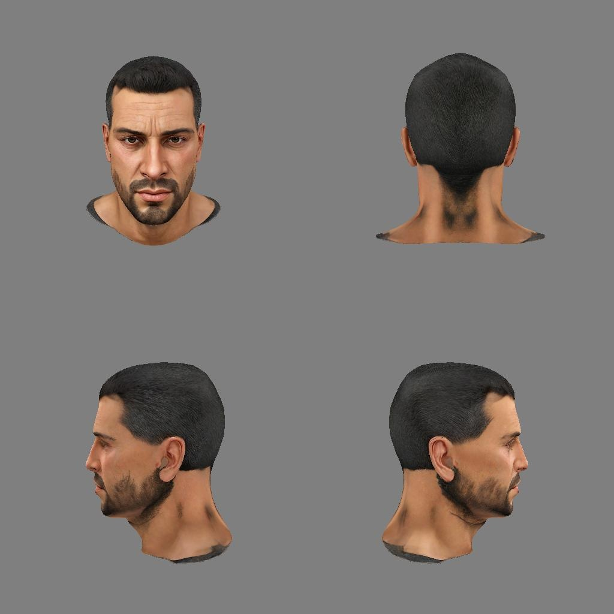
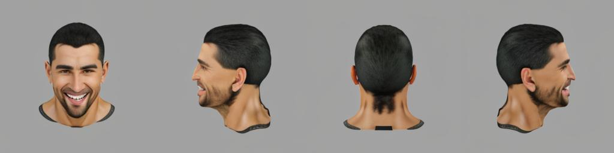

# DreamEdit3D: Personalization of Multi-View Diffusion Models for 3D Editing

**Jinxin Ai · Matthias Nießner · Ziya Erkoç**
Technical University of Munich

[Project page](https://www.jinxinai.org/dreamedit3d/) &nbsp;·&nbsp; [Video](https://youtu.be/PHyvbyREIOw)


DreamEdit3D produces multi-view-consistent edits of 3D objects guided by
natural language. We personalize a multi-view diffusion model to preserve
input identity, then generate diverse edits by composing learned token
embeddings with editing prompts.

Pipeline: SAM-based per-view object segmentation → multi-view textual
inversion + fine-tuning of MVDream (Break-A-Scene-style training) →
multi-view image generation → GTR lifts the views to a textured 3D mesh.

The end-to-end CLI takes a 4-view segmented example folder and a text
prompt, and produces a textured 3D mesh:

1. Train a textual token (`<asset0>`) that represents the input object.
2. Sample a multi-view-consistent image under the new edit prompt.
3. Lift the multi-view image to a textured 3D mesh via GTR.

## Repository layout

```
main.py                       End-to-end CLI (the only root .py)
scripts/
├── train.py                  Multi-view textual-inversion training
├── inference.py              Multi-view image sampler from trained MVDream
└── render_glb_blender.py     Headless Blender renderer for .glb assets
utils/
├── ptp_utils.py              Image-grid + attention-store helpers used during training
├── gpt_object_detector.py    GPT-4V auto-naming of mask concepts (helper)
└── unified_renderer.py       Multi-view render utilities
mvdream/                      MVDream multi-view diffusion (vendored)
snap_gtr/                     GTR image-to-3D (git submodule of
                              ASH30KW/snap_gtr@dreamedit3d, our fork with
                              transparent/RGBA rendering support)
segment-anything/             SAM (git submodule of facebookresearch/segment-anything)
mask/                         SAM checkpoints (runtime, gitignored)
examples/                     Per-example inputs + (gitignored) runtime outputs
```

## Installation

Requires CUDA-capable GPU (tested on 48GB VRAM) and Linux.
Tested on Linux with Python 3.10 and CUDA 12.8.

Clone with submodules so the `segment-anything/` submodule is populated:

```bash
git clone --recurse-submodules https://github.com/ASH30KW/DreamEdit3D.git
# or, on an existing clone:
git submodule update --init --recursive
```

### Option A — conda + pip (recommended)

```bash
conda create -n DreamEdit3D python=3.10 -y
conda activate DreamEdit3D

# 1. PyTorch first, so torch-extension builds can find it later
pip install torch==2.8.0 torchvision==0.23.0+cu128 \
    --extra-index-url https://download.pytorch.org/whl/cu128

# 2. Everything else
pip install -r requirements.txt \
    --extra-index-url https://download.pytorch.org/whl/cu128

# 3. Torch-extension packages (require nvcc 12.x and torch already
#    installed; install the CUDA toolkit first if you don't have it)
conda install -c nvidia cuda-toolkit=12.8 -y
pip install --no-build-isolation diso==0.1.4
pip install --no-build-isolation \
    "nvdiffrast @ git+https://github.com/NVlabs/nvdiffrast.git@v0.3.3"
pip install --no-build-isolation \
    "pytorch3d @ git+https://github.com/facebookresearch/pytorch3d.git@V0.7.7"
```

`requirements.txt` is a frozen snapshot of the working environment.
Adjust the `+cu128` markers and `--extra-index-url` if you target a
different CUDA version.

### Option B — clone an existing conda env

If you already have the original `sam-bas-gtr` env on the same machine:

```bash
conda create --clone sam-bas-gtr --name DreamEdit3D
```

## Required model weights

The repository ships **source only** — download these checkpoints
yourself and place them as shown:

| File | Location | Source |
| --- | --- | --- |
| `sd-v2.1-base-4view.pt` | `models/` | [MVDream release](https://github.com/bytedance/MVDream) |
| `sam_vit_h_4b8939.pth` | `mask/checkpoints/` | [SAM ViT-H](https://dl.fbaipublicfiles.com/segment_anything/sam_vit_h_4b8939.pth) |
| `sam_vit_l_0b3195.pth` *(optional)* | `mask/checkpoints/` | [SAM ViT-L](https://dl.fbaipublicfiles.com/segment_anything/sam_vit_l_0b3195.pth) |
| `sam_vit_b_01ec64.pth` *(optional)* | `mask/checkpoints/` | [SAM ViT-B](https://dl.fbaipublicfiles.com/segment_anything/sam_vit_b_01ec64.pth) |
| `full_checkpoint.pth` (GTR) | `snap_gtr/ckpts/` | [GTR release](https://github.com/snap-research/snap_gtr) |

### Stable Diffusion 2.1 base

The training and inference scripts also need Stable Diffusion 2.1 base,
which is fetched from HuggingFace on first run. Stability AI removed
the original `stabilityai/stable-diffusion-2-1-base` repo, so pass a
public mirror via `--pretrained_model_name_or_path`:

```bash
--pretrained_model_name_or_path sd-research/stable-diffusion-2-1-base
```

If you have an existing local SD2.1 pipeline dump, point at that path
instead.

## Usage

`main.py` runs the full pipeline end-to-end. The exact command verified
end-to-end on `examples/character` (RTX 3090, ~5 min, identity-preserving
smile-with-teeth edit, textured GLB + OBJ mesh):

```bash
python main.py \
  --example_dir examples/character \
  --prompt "a photo of <asset0> smile with teeth" \
  --initializer_token person
```

The example dir must contain `01_sam_masks/view_1/img.jpg` + `mask0.png`,
and one such pair per view (`view_1`, `view_2`, …). See
`examples/character/` for a reference. Outputs land in the same dir:

```
examples/character/
├── 01_sam_masks/                  (input, tracked in git)
├── meta.json                      (input, tracked)
├── 02_train/mvdream_model.pth     ← Stage 1 output
├── 03_multiview_images/result.jpg ← Stage 2 output
├── 04_gtr_prepared/rgb_*.png      ← Stage 3 intermediate
└── 04_gtr_3d/mesh.{glb,obj}       ← Stage 3 final output
```

### Example results

Running the command above on `examples/character` (text_input
"a photo of person" → text_edit "a photo of person smile with teeth"):

**Input — four SAM-segmented views:**



**Stage 2 output — multi-view sample under the edit prompt:**



**Stage 3 output — textured 3D mesh, NeRF turntable:**


The corresponding `mesh.glb` (4.4 MB) and `mesh.obj` (12 MB) land in
`examples/character/04_gtr_3d/` after the run.

### Options

| Flag | Default | Meaning |
| --- | --- | --- |
| `--initializer_token` | `object` | word loosely describing the object (used to init `<asset0>`) |
| `--phase1_steps` / `--phase2_steps` | 400 / 400 | training steps per phase (use 50/50 for a quick smoke test) |
| `--resolution` / `--size` | 256 / 256 | training resolution |
| `--num_frames` | 4 | number of views (set to match your `01_sam_masks/view_*` count) |
| `--seed` | 23 | RNG seed for training + inference |
| `--pretrained_model_name_or_path` | `sd-research/stable-diffusion-2-1-base` | HF model id or local path (see note below) |
| `--skip_train` / `--skip_inference` / `--skip_gtr` | off | re-use an earlier stage's output |

### Stable Diffusion 2.1 base

The training and inference scripts need Stable Diffusion 2.1 base from
HuggingFace. Stability AI removed the original
`stabilityai/stable-diffusion-2-1-base` repo, so `main.py` defaults to
the public mirror `sd-research/stable-diffusion-2-1-base`. If you have
a local SD2.1 pipeline dump, pass its path with
`--pretrained_model_name_or_path`.

## Acknowledgements

DreamEdit3D builds on, and includes source from, these projects:

- [Break-A-Scene](https://github.com/google/break-a-scene) (Avrahami et al., SIGGRAPH Asia 2023) — concept extraction
- [MVDream](https://github.com/bytedance/MVDream) — multi-view diffusion
- [GTR / snap_gtr](https://github.com/snap-research/snap_gtr) — image-to-3D (git submodule of [our fork](https://github.com/ASH30KW/snap_gtr/tree/dreamedit3d) with transparent/RGBA rendering)
- [Segment Anything](https://github.com/facebookresearch/segment-anything) — masking (git submodule)

Please cite the underlying papers when using this code.

## Citation

If you use DreamEdit3D in your work, please cite it as:

```bibtex
@article{ai2026dreamedit3d,
  title     = {DreamEdit3D: Personalization of Multi-View
               Diffusion Models for 3D Editing},
  author    = {Ai, Jinxin and Nie{\ss}ner, Matthias and Erko\c{c}, Ziya},
  journal   = {arXiv preprint},
  year      = {2026}
}
```

## License

Apache 2.0 — see [LICENSE](LICENSE). Vendored third-party code retains
its original license; see each subdirectory.
