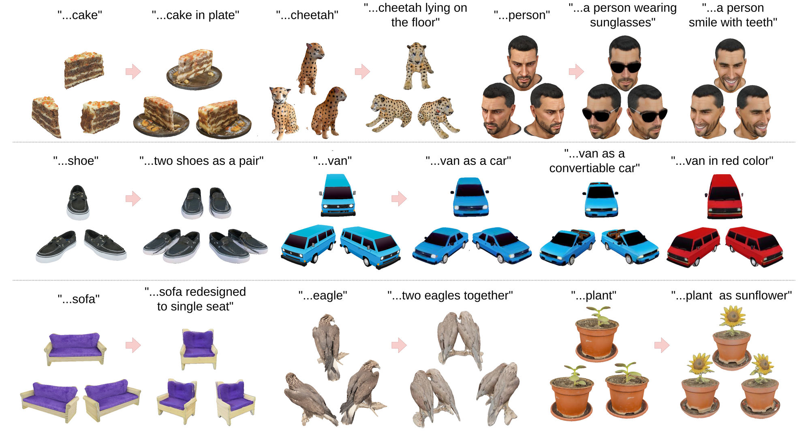

# DreamEdit3D

[Project page](https://www.jinxinai.org/dreamedit3d/) &nbsp;·&nbsp; [Video](https://youtu.be/PHyvbyREIOw)



Text-driven editing of 3D assets from a single image. DreamEdit3D combines
single-image concept extraction (Break-A-Scene), multi-view diffusion
(MVDream), single-image-to-3D reconstruction (GTR), and SAM-based masking
into one Gradio pipeline.

The end-to-end app lets you:

1. Upload an image and segment it into concepts with SAM (optionally
   auto-named with GPT-4V).
2. Train per-concept textual tokens (`<asset0>`, `<asset1>`, ...).
3. Re-render the concepts under new prompts as multi-view images via
   MVDream, then lift them to a 3D mesh with GTR.

## Repository layout

```
main.py                Main Gradio application (entry point)
dreamedit3d.py         Core training logic (per-view textual inversion)
inference.py           CLI multi-view inference
gradio_app.py          Gradio UI components used by the main app
render_glb_blender.py  Headless Blender renderer for .glb assets
ptp_utils.py           Prompt-to-prompt attention utilities
mvdream/               MVDream multi-view diffusion
snap_gtr/              GTR image-to-3D (git submodule of
                       ASH30KW/snap_gtr@dreamedit3d, our fork with
                       transparent/RGBA rendering support)
segment-anything/      SAM (git submodule of facebookresearch/segment-anything)
mask/                  SAM-based masking helpers
utils/                 Shared utilities (incl. GPT-4V auto-naming)
examples/              Example inputs
```

## Installation

Requires CUDA-capable GPU (tested on 48GB VRAM) and Linux.
Tested on Linux with Python 3.10 and CUDA 12.8.

Clone with submodules so the `segment-anything/` submodule is populated:

```bash
git clone --recurse-submodules https://github.com/ASH30KW/DreamEdit3D.git
# or, on an existing clone:
git submodule update --init --recursive
```

### Option A — conda + pip (recommended)

```bash
conda create -n DreamEdit3D python=3.10 -y
conda activate DreamEdit3D

# 1. PyTorch first, so torch-extension builds can find it later
pip install torch==2.8.0 torchvision==0.23.0+cu128 \
    --extra-index-url https://download.pytorch.org/whl/cu128

# 2. Everything else
pip install -r requirements.txt \
    --extra-index-url https://download.pytorch.org/whl/cu128

# 3. Torch-extension packages (require nvcc 12.x and torch already
#    installed; install the CUDA toolkit first if you don't have it)
conda install -c nvidia cuda-toolkit=12.8 -y
pip install --no-build-isolation diso==0.1.4
pip install --no-build-isolation \
    "nvdiffrast @ git+https://github.com/NVlabs/nvdiffrast.git@v0.3.3"
pip install --no-build-isolation \
    "pytorch3d @ git+https://github.com/facebookresearch/pytorch3d.git@V0.7.7"
```

`requirements.txt` is a frozen snapshot of the working environment.
Adjust the `+cu128` markers and `--extra-index-url` if you target a
different CUDA version.

### Option B — clone an existing conda env

If you already have the original `sam-bas-gtr` env on the same machine:

```bash
conda create --clone sam-bas-gtr --name DreamEdit3D
```

## Required model weights

The repository ships **source only** — download these checkpoints
yourself and place them as shown:

| File | Location | Source |
| --- | --- | --- |
| `sd-v2.1-base-4view.pt` | `models/` | [MVDream release](https://github.com/bytedance/MVDream) |
| `sam_vit_h_4b8939.pth` | `mask/checkpoints/` | [SAM ViT-H](https://dl.fbaipublicfiles.com/segment_anything/sam_vit_h_4b8939.pth) |
| `sam_vit_l_0b3195.pth` *(optional)* | `mask/checkpoints/` | [SAM ViT-L](https://dl.fbaipublicfiles.com/segment_anything/sam_vit_l_0b3195.pth) |
| `sam_vit_b_01ec64.pth` *(optional)* | `mask/checkpoints/` | [SAM ViT-B](https://dl.fbaipublicfiles.com/segment_anything/sam_vit_b_01ec64.pth) |
| `full_checkpoint.pth` (GTR) | `snap_gtr/ckpts/` | [GTR release](https://github.com/snap-research/snap_gtr) |

### Stable Diffusion 2.1 base

The training and inference scripts also need Stable Diffusion 2.1 base,
which is fetched from HuggingFace on first run. Stability AI removed
the original `stabilityai/stable-diffusion-2-1-base` repo, so pass a
public mirror via `--pretrained_model_name_or_path`:

```bash
--pretrained_model_name_or_path sd-research/stable-diffusion-2-1-base
```

If you have an existing local SD2.1 pipeline dump, point at that path
instead.

## Configuration

The Gradio app uses GPT-4V for automatic concept naming. Set your key
before launching:

```bash
export OPENAI_API_KEY="sk-..."
# or copy .env.example to .env and edit
```

If the key is not set, auto-naming is disabled but the rest of the
pipeline still works.

## Usage

### Launch the app

```bash
python main.py
```

Then open the URL Gradio prints (default `http://localhost:7860`).

### CLI: train a single concept (4-view)

The `instance_data_dir` should contain `view_1/`, `view_2/`, ...,
`view_N/` subdirectories, each with `img.jpg` and per-asset mask files
(`mask0.png`, `mask1.png`, ...).

```bash
PYTORCH_CUDA_ALLOC_CONF=expandable_segments:True python dreamedit3d.py \
  --pretrained_model_name_or_path sd-research/stable-diffusion-2-1-base \
  --instance_data_dir projects/14_human_smile_with_teeth/01_sam_masks \
  --num_of_assets 1 \
  --initializer_tokens person \
  --phase1_train_steps 400 \
  --phase2_train_steps 400 \
  --output_dir projects/14_human_smile_with_teeth/02_train \
  --no_prior_preservation \
  --use_8bit_adam \
  --set_grads_to_none \
  --resolution 256 \
  --size 128 \
  --num_frames 4 \
  --mvdream_training_mode 2d
```

Verified end-to-end on an RTX 3090 with a reduced 50+50-step run
(~26 s training, ~3 s inference); use 400+400 for production quality.

### CLI: inference

```bash
python inference.py \
  --model_path projects/14_human_smile_with_teeth/02_train \
  --prompt "a photo of <asset0> smile with teeth" \
  --output_path projects/14_human_smile_with_teeth/03_inference.jpg \
  --num_frames 4 \
  --size 256
```

## Acknowledgements

DreamEdit3D builds on, and includes source from, these projects:

- [Break-A-Scene](https://github.com/google/break-a-scene) (Avrahami et al., SIGGRAPH Asia 2023) — concept extraction
- [MVDream](https://github.com/bytedance/MVDream) — multi-view diffusion
- [GTR / snap_gtr](https://github.com/snap-research/snap_gtr) — image-to-3D (git submodule of [our fork](https://github.com/ASH30KW/snap_gtr/tree/dreamedit3d) with transparent/RGBA rendering)
- [Segment Anything](https://github.com/facebookresearch/segment-anything) — masking (git submodule)

Please cite the underlying papers when using this code.

## License

Apache 2.0 — see [LICENSE](LICENSE). Vendored third-party code retains
its original license; see each subdirectory.
